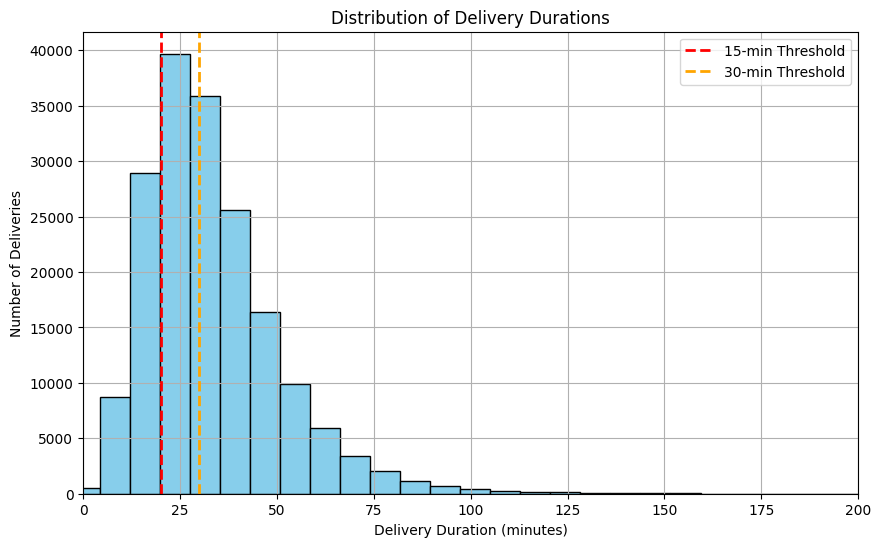
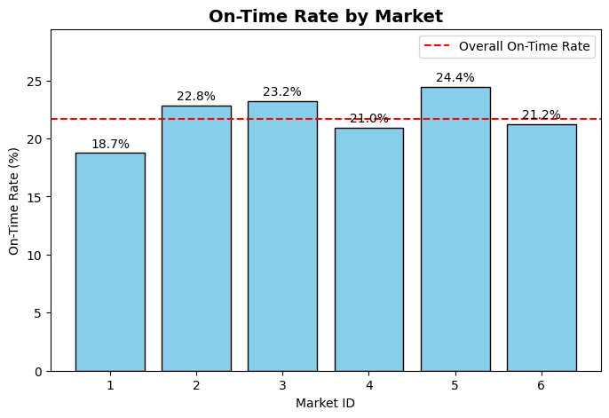
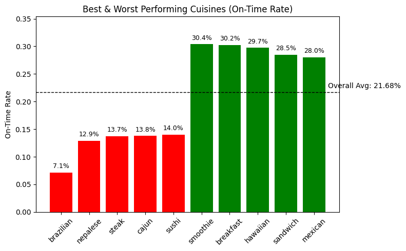
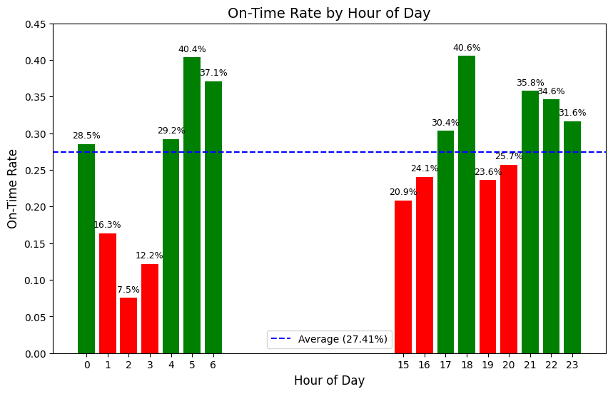
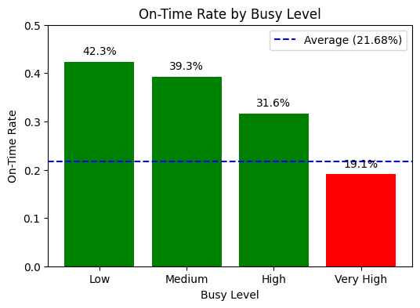
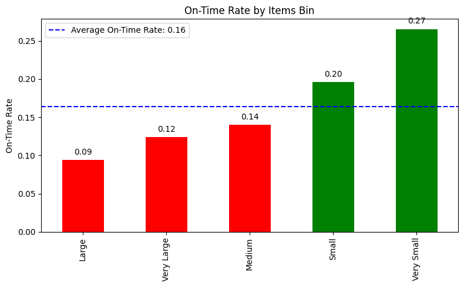
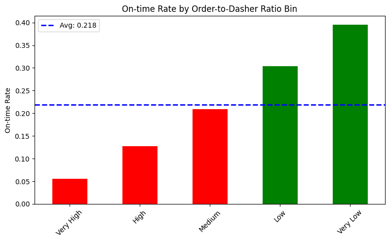

---

# **DoorDash Delivery Delay Analysis**

---

## **Project Overview**

This project investigates delivery performance across DoorDash markets in early 2015, focusing on **why some markets underperform**. The primary KPI is **On-Time Delivery Rate (`is_on_time`)**, measuring the percentage of orders delivered on or before the promised time.

**Objective:** Identify **drivers of delivery delays**—including market-specific factors, cuisine types, order size, and time of day—and provide **actionable recommendations** to improve operational efficiency and customer satisfaction.

---

## **Problem Statement**

Key questions addressed:

* Which markets have the **lowest and highest on-time delivery rates**?
* How do **order size, cuisine type, time of day, and operational ratios** affect lateness?
* What **structural or operational factors** drive delays in the worst-performing market?
* Can interventions like **reducing busy ratio** or **adjusting order-to-dasher ratio** improve on-time rates?

---

## **Data**

* **Source:** [DoorDash ETA Prediction Dataset](https://www.kaggle.com/datasets/dharun4772/doordash-eta-prediction) (MIT License)
* **Timeframe:** Early 2015
* **Size:** \~197,428 orders

**Key Columns:**

| Column                  | Description                       |
| ----------------------- | --------------------------------- |
| `is_on_time`            | 1 if delivered on time, 0 if late |
| `market_id`             | Market identifier                 |
| `cuisine_grouped`       | Cuisine type                      |
| `hour_of_day`           | Delivery hour                     |
| `order_volume`          | Number of items in order          |
| `busy_ratio`            | Market busyness at the time       |
| `order_to_dasher_ratio` | Orders per available dasher       |

**Data Cleaning & Preprocessing:**

* Excluded hours with fewer than 500 deliveries to avoid misleading statistics.
* Binned lateness and order size for clearer analysis.

---

## **Approach / Methodology**

1. **Exploratory Data Analysis (EDA)**

   * Analyzed on-time delivery rates by market, cuisine, order size, and hour of day.
   * Identified **problematic hours and patterns** visually.

2. **Statistical Testing**

   * **Chi-square tests** for comparing on-time rates across markets and cuisines.
   * **Paired t-tests** to control for cuisine when comparing markets.
   * **Logistic regression** to assess the impact of market, busy ratio, and order-to-dasher ratio on lateness.

3. **Root Cause Analysis**

   * Focused on **worst-performing market (Market 1)** to identify structural inefficiencies.
   * Simulated **A/B tests** to evaluate the potential impact of interventions.

---

## **Key Findings**

* **Overall On-Time Rate:** 21.68% (reflecting early-stage delivery systems).

**Market Performance:**

| Market           | On-Time Rate |
| ---------------- | ------------ |
| Best (Market 5)  | 24.42%       |
| Worst (Market 1) | 18.74%       |

**Cuisine Impact:**

* Slowest: Brazilian & Nepalese
* Fastest: Smoothies & Breakfast items

**Time-of-Day Impact:**

* Worst: 2–3 AM (7.54–12.17%), 3–8 PM (20.86–25.69%)
* Best: Early morning & late evening (>37%)

**Order Size Effect:**

* Very large orders: 9.39% on-time
* Very small orders: 26.55% on-time

**Operational KPIs:**

* High **order-to-dasher ratios** increase delays (OR \~4.3 for Market 1).
* Busy dashers worsen delays, especially in Market 1.
* Single-variable interventions (reducing busy ratio or order-to-dasher ratio by 30%) **do not significantly improve on-time rates** (p > 0.4).

**Structural Issues:**

* Market 1 shows high lateness even outside peak hours, indicating **deep operational inefficiencies**.

---

## **Business Recommendations**

| Observation                         | Suggested Action                                                 | Expected Impact                                 |
| ----------------------------------- | ---------------------------------------------------------------- | ----------------------------------------------- |
| Market 1 underperforms              | Conduct operational audits: driver allocation, batching, routing | Improved on-time rates                          |
| High order-to-dasher ratio          | Increase dasher supply or optimize assignment during peak hours  | Reduce delays and driver overload               |
| Peak hours (3–8 PM, 2–3 AM)         | Dynamic scheduling & pre-position dashers                        | Smooth delivery during high-demand periods      |
| Slow cuisines (Brazilian, Nepalese) | Work with restaurants on prep accuracy & routing prioritization  | Faster delivery for challenging orders          |
| Large orders delayed                | Implement batching strategies or allocate additional resources   | Reduce lateness for high-item orders            |
| Single-variable interventions fail  | Combine operational changes (extra dashers + improved batching)  | Greater improvement than isolated interventions |
| Customer experience risk            | Communicate realistic ETAs and proactive delay notifications     | Higher satisfaction & retention                 |

---

## **Visualizations / Dashboard**

*(Include these as images or link to Tableau dashboard)*

* Histogram of delivery durations with on-time thresholds (15, 20, 30 mins)

* “Market-Level On-Time Delivery Performance”

* On-Time Delivery Performance by Cuisine Type

* Hourly Trends in Delivery Timeliness

* Impact of Busyness on Delivery Performance

* Delivery Performance by Order Size

* On-Time rate by Order to Dasher Ratio

---

## **Tools & Technologies**

* **Python:** Pandas, NumPy, Seaborn, Matplotlib, SciPy, Statsmodels
* **Tableau:** Interactive dashboards

---

## **Future Work / Next Steps**

* Investigate real-time dasher assignment algorithms
* Explore seasonal or holiday trends affecting lateness
* Pilot combined operational interventions and measure impact
* Apply predictive ML models for delivery times

---
