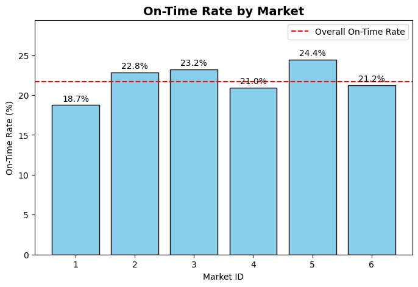

---

# **DoorDash Delivery Delay Analysis**

---

## **Project Overview**

This project investigates delivery performance across DoorDash markets in early 2015, focusing on **why some markets underperform**. The primary KPI is **On-Time Delivery Rate (`is_on_time`)**, measuring the percentage of orders delivered on or before the promised time.

**Objective:** Identify **drivers of delivery delays**—including market-specific factors, cuisine types, order size, and time of day—and provide **actionable recommendations** to improve operational efficiency and customer satisfaction.

---

## **Problem Statement**

Key questions addressed:

* Which markets have the **lowest and highest on-time delivery rates**?
* How do **order size, cuisine type, time of day, and operational ratios** affect lateness?
* What **structural or operational factors** drive delays in the worst-performing market?
* Can interventions like **reducing busy ratio** or **adjusting order-to-dasher ratio** improve on-time rates?

---

## **Data**

* **Source:** [DoorDash ETA Prediction Dataset](https://www.kaggle.com/datasets/dharun4772/doordash-eta-prediction) (MIT License)
* **Timeframe:** Early 2015
* **Size:** \~197,428 orders

**Key Columns:**

| Column                  | Description                       |
| ----------------------- | --------------------------------- |
| `is_on_time`            | 1 if delivered on time, 0 if late |
| `market_id`             | Market identifier                 |
| `cuisine_grouped`       | Cuisine type                      |
| `hour_of_day`           | Delivery hour                     |
| `order_volume`          | Number of items in order          |
| `busy_ratio`            | Market busyness at the time       |
| `order_to_dasher_ratio` | Orders per available dasher       |

**Data Cleaning & Preprocessing:**

* Excluded hours with fewer than 500 deliveries to avoid misleading statistics.
* Binned lateness and order size for clearer analysis.

---

## **Approach / Methodology**

1. Data Prep – Engineered is_on_time KPI, calculated delays, and binned lateness.

2. EDA – Compared markets with distributions, segmentations, and key KPIs.

3. KPI Tree – Broke down on-time performance by region, cuisine, and busyness.

4. Stat Tests – Ran hypothesis tests and logistic regression to quantify drivers.

5. Visualization – Built an interactive Tableau dashboard.

6. Simulated A/B Test – Modeled interventions (e.g., more dashers, batching changes) using historical data to estimate impact on on-time rate.

7. Recommendations – Proposed operational and product fixes for Market 1.

---
#  Key Performance Indicator (KPI)

**Primary KPI: On-Time Delivery Rate (`is_on_time`)**
Percentage of orders delivered on or before the promised time.

* Directly impacts **customer satisfaction & retention**
* Reflects **operational efficiency**
* Allows **market-to-market performance comparison**

**Overall on-time delivery rate:** **21.68%**

For this analysis, a delivery is considered **“late”** if it arrives **20 minutes or more** past the promised time (reflecting 2015 customer expectations & operational variability).

---

## Supporting KPIs

* **Market Performance**: Market 5 (24.42%) vs Market 1 (18.74%). Market 1 lags by \~5.7 percentage points.
* **Cuisine Type**: Brazilian & Nepalese → lowest on-time rates; smoothies & breakfast → highest.
* **Hour of Day**: Lowest rates at 2–3 AM; dinner rush (3–8 PM) also struggles.
* **Busy Ratio & Order-to-Dasher Ratio**: High ratios drastically reduce on-time performance (as low as \~6% on time).
* **Order Size**: Large orders significantly more likely to be late.
* **Order Volume**: Market 1 sees sharper peaks than Market 5, stressing driver supply.

---

## Statistical Tests

* Market 1 has **significantly lower on-time rates** than Market 5 (p < 0.001).
* Market 1 has **more problematic cuisines** (p < 0.05).
* Within the same cuisines, Market 1 still underperforms (p < 0.05).
* Larger orders are **significantly correlated** with lateness in both markets.
* Volume alone cannot explain Market 1’s underperformance (p > 0.05).

---

## Logistic Regression Insights

* **Baseline gap**: Market 1 starts structurally worse (OR ≈ 0.50 at zero busyness).
* **Busyness effect**:

  * Market 5 → OR ≈ 0.13 (fragile during peaks).
  * Market 1 → OR ≈ 0.24 (weak overall, less sensitive to spikes).
* **Interaction**: Market 5 needs surge flexibility; Market 1 needs structural fixes.

---

##  Business Recommendations

### **1. Fix Structural Issues in Market 1**

* **Dasher Allocation**: Recruit more drivers or rebalance coverage, especially in low-performing areas.
* **Restaurant Partnerships**: Prioritize onboarding restaurants with fast prep times or implement prep-time accuracy checks.
* **Geographic Bottlenecks**: If Market 1 has longer average delivery distances, consider micro-fulfillment hubs or restricting long-radius deliveries.

### **2. Improve Peak-Time Performance in Market 5**

* **Surge Strategy**: Strengthen surge pricing and incentives to attract dashers during dinner rush & overnight hours.
* **Dynamic Allocation**: Deploy predictive models to pre-position dashers before demand spikes.
* **Queue Management**: Cap order acceptance per dasher during extreme peaks to prevent collapse.

### **3. Cuisine-Level Improvements**

* **Slow Cuisines**: For cuisines like Brazilian/Nepalese, set more realistic ETAs or work with restaurants to streamline prep.
* **Fast Cuisines**: Leverage cuisines like smoothies/breakfast to improve average performance (e.g., promotions, bundling).
* **Menu Optimization**: Encourage restaurants to flag high-prep items so ETAs adjust accordingly.

### **4. Manage Large Orders Separately**

* **ETA Adjustments**: Clearly display longer ETAs for large orders to align customer expectations.
* **Dasher Assignment**: Assign experienced dashers or double-dashers for oversized deliveries.
* **Operational Process**: Explore batch-prep strategies in kitchens to speed up large orders.

### **5. Monitor Order-to-Dasher Ratio as a Leading KPI**

* **Live Dashboards**: Track this ratio in real-time to trigger interventions.
* **Threshold Alerts**: Set thresholds where auto-incentives (bonus pay) activate to attract more dashers.
* **Market Prioritization**: Focus staffing efforts on markets with consistently high ratios.

---

## **Visualizations / Dashboard**

*(Include these as images or link to Tableau dashboard)*

* Histogram of delivery durations with on-time thresholds (15, 20, 30 mins)
  

* “Market-Level On-Time Delivery Performance”
  

* On-Time Delivery Performance by Cuisine Type
  

* Hourly Trends in Delivery Timeliness
  

* Impact of Busyness on Delivery Performance
  

* Delivery Performance by Order Size
  

* On-Time rate by Order to Dasher Ratio

---

## **Tools & Technologies**

* **Python:** Pandas, NumPy, Seaborn, Matplotlib, SciPy, Statsmodels
* **Tableau:** Interactive dashboards

---

## **Future Work / Next Steps**

* Investigate real-time dasher assignment algorithms
* Explore seasonal or holiday trends affecting lateness
* Pilot combined operational interventions and measure impact
* Apply predictive ML models for delivery times

---
