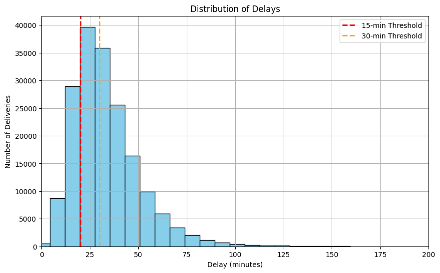

---

# **Delivery Insights Identifying Drivers of Delays**

---

## **Project Overview**

This project investigates delivery performance across DoorDash markets in early 2015, focusing on **why some markets underperform**. The primary KPI is **On-Time Delivery Rate (`is_on_time`)**, measuring the percentage of orders delivered on or before the promised time.

**Objective:** Identify **drivers of delivery delays**—including market-specific factors, cuisine types, order size, and time of day—and provide **actionable recommendations** to improve operational efficiency and customer satisfaction.

---

## **Problem Statement**

Key questions addressed:

* Which markets have the **lowest and highest on-time delivery rates**?
* How do **order size, cuisine type, time of day, and operational ratios** affect lateness?
* What **structural or operational factors** drive delays in the worst-performing market?
* Can interventions like **reducing busy ratio** or **adjusting order-to-dasher ratio** improve on-time rates?

---

## **Data**

* **Source:** [DoorDash ETA Prediction Dataset](https://www.kaggle.com/datasets/dharun4772/doordash-eta-prediction) (MIT License)
* **Timeframe:** Early 2015
* **Size:** \~197,428 orders

**Key Columns:**

| Column                  | Description                       |
| ----------------------- | --------------------------------- |
| `is_on_time`            | 1 if delivered on time, 0 if late |
| `market_id`             | Market identifier                 |
| `cuisine_grouped`       | Cuisine type                      |
| `hour_of_day`           | Delivery hour                     |
| `order_volume`          | Number of items in order          |
| `busy_ratio`            | Market busyness at the time       |
| `order_to_dasher_ratio` | Orders per available dasher       |

**Data Cleaning & Preprocessing:**

* Excluded hours with fewer than 500 deliveries to avoid misleading statistics.
* Binned lateness and order size for clearer analysis.

---

## **Approach / Methodology**

1. Data Prep – Engineered is_on_time KPI, calculated delays, and binned lateness.

2. EDA – Compared markets with distributions, segmentations, and key KPIs.

3. KPI Tree – Broke down on-time performance by region, cuisine, and busyness.

4. Stat Tests – Ran hypothesis tests and logistic regression to quantify drivers.

5. Visualization – Built an interactive Tableau dashboard.

6. Simulated A/B Test – Modeled interventions (e.g., more dashers, batching changes) using historical data to estimate impact on on-time rate.

7. Recommendations – Proposed operational and product fixes for Market 1.

---
#  Key Performance Indicator (KPI)

**Primary KPI: On-Time Delivery Rate (`is_on_time`)**
Percentage of orders delivered on or before the promised time.

* Directly impacts **customer satisfaction & retention**
* Reflects **operational efficiency**
* Allows **market-to-market performance comparison**

**Overall on-time delivery rate:** **21.68%**

For this analysis, a delivery is considered **“late”** if it arrives **20 minutes or more** past the promised time (reflecting 2015 customer expectations & operational variability).

---

## Supporting KPIs

* **Market Performance**: Market 5 (24.42%) vs Market 1 (18.74%). Market 1 lags by \~5.7 percentage points.
* **Cuisine Type**: Brazilian & Nepalese → lowest on-time rates; smoothies & breakfast → highest.
* **Hour of Day**: Lowest rates at 2–3 AM; dinner rush (3–8 PM) also struggles.
* **Busy Ratio & Order-to-Dasher Ratio**: High ratios drastically reduce on-time performance (as low as \~6% on time).
* **Order Size**: Large orders significantly more likely to be late.
* **Order Volume**: Market 1 sees sharper peaks than Market 5, stressing driver supply.

---

## Statistical Tests

* Market 1 has **significantly lower on-time rates** than Market 5 (p < 0.001).
* Market 1 has **more problematic cuisines** (p < 0.05).
* Within the same cuisines, Market 1 still underperforms (p < 0.05).
* Larger orders are **significantly correlated** with lateness in both markets.
* Volume alone cannot explain Market 1’s underperformance (p > 0.05).

---

## Logistic Regression Insights

* **Baseline gap**: Market 1 starts structurally worse (OR ≈ 0.50 at zero busyness).
* **Busyness effect**:

  * Market 5 → OR ≈ 0.13 (fragile during peaks).
  * Market 1 → OR ≈ 0.24 (weak overall, less sensitive to spikes).
* **Interaction**: Market 5 needs surge flexibility; Market 1 needs structural fixes.

---
---

##  A/B Test Results

To evaluate potential interventions, I ran two simulated A/B tests on Market 1.  
The goal was to see whether improving **system busyness** (busy_ratio) or **dasher availability** (order_to_dasher_ratio) would lead to better on-time delivery rates.

### Test 1: Reduce Busy Ratio
- **Null Hypothesis (H₀):** No difference in on-time rate between reduced busy_ratio group and control.  
- **Result:** p-value = 0.407 (> 0.05)  
- **Interpretation:** Fail to reject H₀ → No statistically significant improvement.

### Test 2: Reduce Order-to-Dasher Ratio
- **Null Hypothesis (H₀):** No difference in on-time rate between reduced order_to_dasher_ratio group and control.  
- **Result:** p-value = 0.447 (> 0.05)  
- **Interpretation:** Fail to reject H₀ → No statistically significant improvement.

---

###  Key Takeaway
Both simulated interventions **did not yield statistically significant improvements** in on-time delivery rates.  
This suggests that fixing individual ratios does not improve the on-time delivery rates, and may require **deeper operational or product-level interventions** (e.g., cuisine-specific prep times, batching logic, or regional driver incentives).

---

## **Business Recommendations**

| Observation                         | Suggested Action                                                 | Expected Impact                                 |
| ----------------------------------- | ---------------------------------------------------------------- | ----------------------------------------------- |
| Market 1 underperforms              | Conduct operational audits: driver allocation, batching, routing | Improved on-time rates                          |
| High order-to-dasher ratio          | Increase dasher supply or optimize assignment during peak hours  | Reduce delays and driver overload               |
| Peak hours (3–8 PM, 2–3 AM)         | Dynamic scheduling & pre-position dashers                        | Smooth delivery during high-demand periods      |
| Slow cuisines (Brazilian, Nepalese) | Work with restaurants on prep accuracy & routing prioritization  | Faster delivery for challenging orders          |
| Large orders delayed                | Implement batching strategies or allocate additional resources   | Reduce lateness for high-item orders            |
| Single-variable interventions fail  | Combine operational changes (extra dashers + improved batching)  | Greater improvement than isolated interventions |
| Customer experience risk            | Communicate realistic ETAs and proactive delay notifications     | Higher satisfaction & retention                 |

---

---

## **Visualizations / Dashboard**

Tableau Dashboard: https://public.tableau.com/views/DeliveryInsights_17554220126250/DeliveryInsights?:language=en-US&:sid=&:redirect=auth&showOnboarding=true&:display_count=n&:origin=viz_share_link 

* Histogram of delivery durations with on-time thresholds (15, 20, 30 mins)
  

* “Market-Level On-Time Delivery Performance”
  

* On-Time Delivery Performance by Cuisine Type
  

* Hourly Trends in Delivery Timeliness
  

* Impact of Busyness on Delivery Performance
  

* Delivery Performance by Order Size
  

* On-Time rate by Order to Dasher Ratio

---

## **Tools & Technologies**

* **Python:** Pandas, NumPy, Seaborn, Matplotlib, SciPy, Statsmodels
* **Tableau:** Interactive dashboards

---

## **Future Work / Next Steps**

* Investigate real-time dasher assignment algorithms
* Explore seasonal or holiday trends affecting lateness
* Pilot combined operational interventions and measure impact
* Apply predictive ML models for delivery times

---
